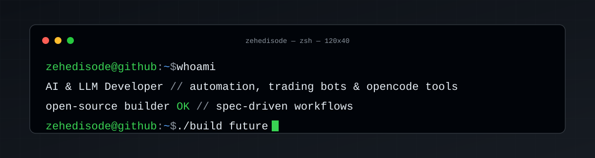

<p align="center">
  
</p>

<h1 align="center">👋 Merhaba, ben zehedisode</h1>
<p align="center"><b>AI &amp; LLM Developer</b> — otomasyon, trading botları ve opencode agent/araçları üretiyorum.</p>

<p align="center">
  <a href="https://github.com/zehedisode?tab=repositories"></a>
  <a href="https://github.com/zehedisode"></a>
  
  
</p>

---

<p align="center">
  <picture>
    <source media="(prefers-color-scheme: dark)" srcset="https://neofetch-profile.vercel.app/api?username=zehedisode&theme=github-dark">
    
  </picture>
</p>

<p align="center">
  
  
</p>

---

## 🧰 Tech Stack

<p align="center">
  
  
  
  
  
  
</p>

## 🚀 Öne çıkan projeler

| Proje | Açıklama |
|-------|----------|
| [youtube-turkce-ceviri](https://github.com/zehedisode/youtube-turkce-ceviri) | YouTube videolarını Türkçe'ye çeviren araç |
| [spec-orchestrator](https://github.com/zehedisode/spec-orchestrator) | OpenCode Spec Kit orkestratör agent'ı |
| [opencode-config](https://github.com/zehedisode/opencode-config) | OpenCode agent & config dosyalarım |
| [spotify-automation-chrome-extension](https://github.com/zehedisode/spotify-automation-chrome-extension) | Spotify'i otomatikleştiren Chrome uzantısı |
| [Stereo-Ses-Gorsellestirici](https://github.com/zehedisode/Stereo-Ses-Gorsellestirici) | Stereo sesi görselleştiren Python uygulaması |

## 💻 Terminal'de

```text
$ whoami
zehedisode — AI & LLM developer, open-source builder

$ cat interests.txt
> LLM orkestrasyonu & AI agent'ları
> Otomasyon & bot geliştirme
> Algo / trading botlar
> OpenCode yapılandırması & agent'lar

$ ./build future
[✔] committed with GPG signature
```

## 📫 İletişim

- 🌐 Blog / Link: [github.com/zehedisode](https://github.com/zehedisode)
- 📫 Issues & PR'ler için repolarımı kullanabilirsin

---

<p align="center">
  <i>⚡ Geliştirme iş akışım Spec Kit + OpenCode agent'larıyla yürüyor.</i>
</p>
